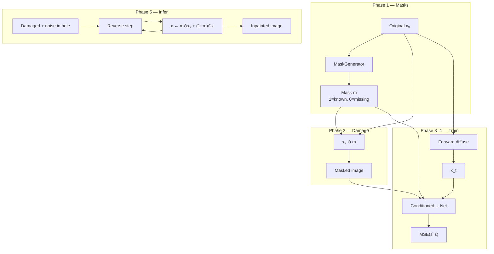

# diffusion-image-inpainting

Mask-conditioned **DDPM image inpainting**. This project does not reimplement diffusion from scratch — it **imports** my existing package and turns it into a practical restoration pipeline.

```
image_inpainting  →  imports  →  generative_models.ddpm
```

That is the usual research-codebase pattern: keep the generative core reusable, and grow applications on top of it.

| Stage | Dataset | Goal |
|-------|---------|------|
| 1 | MNIST | Fast end-to-end pipeline |
| 2 | Fashion-MNIST | Textures |
| 3 | CelebA | Faces |
| 4 | Places365 | Natural scenes |
| 5 | Medical | Domain transfer once the pipeline is solid |

---

## Table of contents

1. [Idea](#idea)
2. [How this relates to my DDPM](#how-this-relates-to-my-ddpm)
3. [Pipeline](#pipeline)
4. [Project structure](#project-structure)
5. [Setup](#setup)
6. [Implementation roadmap](#implementation-roadmap)
7. [Dataset progression](#dataset-progression)
8. [Papers (read as I build)](#papers-read-as-i-build)
9. [License](#license)

---

## Idea

Given an image with missing regions, recover plausible content that matches the known pixels.

```
Original          Mask (1=known)       Damaged            Inpainted
██████████        1111111111           ██████████         ██████████
██  8   ██   +    1110000111     →     ██      ██    →    ██  8   ██
██████████        1111111111           ██████████         ██████████
```

### Training

Same noise-prediction objective as standard DDPM, with extra conditioning:

```
original → mask → damaged → forward diffuse → UNet(x_t, masked, mask) → MSE(ε̂, ε)
```

### Inference (the important line)

Start from noise in the missing region, run reverse diffusion, and **after every step** reinsert known pixels:

```text
x = mask * original + (1 - mask) * generated
```

Only the hole is free to change. Everything else is locked to the observation.

---

## How this relates to my DDPM

| Component | Lives in | Role here |
|-----------|----------|-----------|
| Noise schedule, forward diffusion | `generative_models.ddpm` | Reused as-is |
| U-Net backbone | `generative_models.ddpm.UNet` | Reused with **more input channels** |
| Noise-prediction MSE | `generative_models.losses` | Reused |
| MaskGenerator | **this repo** | Create known/missing masks |
| InpaintingDataset | **this repo** | `(original, masked, mask)` |
| ConditionedUNet | **this repo** | Concat `[x_t \| masked \| mask]` |
| Inpaint sampler | **this repo** | Reverse steps + pixel reinsertion |
| PSNR / SSIM / LPIPS | **this repo** | Evaluation |

I do **not** copy DDPM source into this tree. I install the sibling package and import it.

---

## Pipeline



### U-Net input (MNIST)

| Channel group | Channels | Meaning |
|---------------|----------|---------|
| `x_t` | 1 | Noisy latent at timestep \(t\) |
| masked image | 1 | Known pixels (zeros in the hole) |
| mask | 1 | Binary known/missing map |
| **Total** | **3** | `in_channels=3` into reused U-Net |

### Mask types (`MaskGenerator`)

| Type | What it simulates |
|------|-------------------|
| Center square | Large contiguous hole |
| Random rectangle | Irregular block occlusion |
| Brush strokes | Scratches / strokes |
| Random holes | Scattered missing pixels |

---

## Project structure

```
diffusion-image-inpainting/
├── configs/
│   └── mnist.yaml              # Stage 1 hyperparameters
├── docs/assets/                # README figures (added as I train)
├── data/                       # Datasets (gitignored)
├── notebooks/                  # Optional exploration
├── outputs/                    # Checkpoints, samples, logs (gitignored)
├── scripts/
│   ├── visualize_masks.py      # Phase 1–2 sanity grids
│   ├── train.py                # Phase 4
│   ├── inpaint.py              # Phase 5
│   └── evaluate.py             # Phase 6
├── tests/
│   └── test_imports.py         # Package + generative_models.ddpm smoke test
└── src/image_inpainting/
    ├── masks/                  # MaskGenerator
    ├── datasets/               # InpaintingDataset
    ├── models/                 # ConditionedUNet → generative_models.ddpm.UNet
    ├── diffusion/              # RePaint-style sampler
    ├── trainers/               # Mask-conditioned training loop
    ├── evaluation/             # PSNR, SSIM, LPIPS
    └── utils/                  # YAML config helpers
```

---

## Setup

### 1. Install my DDPM package

This project depends on [`generative-models`](https://github.com/HusseinHanafy207/generative-models) (specifically `generative_models.ddpm`). Clone it and install in editable mode:

```bash
git clone https://github.com/HusseinHanafy207/generative-models.git
pip install -e ./generative-models
```

If `generative-models` already lives next to this repo, point `pip` at that checkout instead:

```bash
pip install -e /path/to/generative-models
```

### 2. Install this project

```bash
python -m venv .venv
.venv\Scripts\activate          # Windows
# source .venv/bin/activate     # macOS / Linux

pip install -r requirements.txt
pip install -e ".[dev]"
```

Optional perceptual metrics later:

```bash
pip install -e ".[eval]"
```

### 3. Verify imports

```bash
pytest tests/test_imports.py -q
python -c "from generative_models.ddpm import UNet, NoiseScheduler; print('DDPM OK')"
python -c "import image_inpainting; print(image_inpainting.__version__)"
```

### Planned CLIs (stubs for now)

```bash
python scripts/visualize_masks.py --out-dir outputs/figures
python scripts/verify_conditioned_unet.py
python scripts/train.py --config configs/mnist.yaml --epochs 1
python scripts/inpaint.py --checkpoint outputs/checkpoints/latest.pt --mask-type center
python scripts/evaluate.py --checkpoint outputs/checkpoints/latest.pt
```

---

## Implementation roadmap

I will work in this order. Modules already exist as API stubs with `NotImplementedError` where logic belongs.

| Stage | Deliverable | Module / script |
|-------|-------------|-----------------|
| **0** | Project layout + README + import from DDPM | ✅ this scaffold |
| **1** | Flexible `MaskGenerator` | ✅ `masks/generator.py`, `visualize_masks.py` |
| **2** | `InpaintingDataset` → `(x, masked, mask)` | ✅ `datasets/inpainting.py` |
| **3** | Condition U-Net on masked image + mask | ✅ `models/conditioned_unet.py` |
| **4** | Training loop (mask → diffuse → MSE) | `trainers/trainer.py`, `scripts/train.py` |
| **5** | Reverse inpainting + known-pixel reinsertion | `diffusion/inpaint_sampler.py`, `scripts/inpaint.py` |
| **6** | Visual + PSNR / SSIM (+ LPIPS later) | `evaluation/metrics.py`, `scripts/evaluate.py` |
| **7** | Harder datasets → medical | new configs under `configs/` |

### Phase checklist

- [x] Stage 0 — repo structure, configs, stubs, README
- [x] Stage 1 — masks (center, rectangle, brush, holes)
- [x] Stage 2 — damaged images via `InpaintingDataset`
- [x] Stage 3 — conditioned U-Net input channels
- [ ] Stage 4 — training
- [ ] Stage 5 — inference with `x = m⊙x₀ + (1−m)⊙x̂`
- [ ] Stage 6 — evaluation metrics
- [ ] Stage 7 — Fashion-MNIST → CelebA → Places365 → medical

---

## Dataset progression

I will not jump straight to medical images. I will use the same pipeline and raise difficulty:

1. **MNIST** — I already have loaders and a trained DDPM; iterate fast  
2. **Fashion-MNIST** — edges and textures  
3. **CelebA** — structure and identity  
4. **Places365** — diverse natural scenes  
5. **Medical** — once train / inpaint / eval are trustworthy  

Each new dataset should mostly mean a new YAML config and dataloader adapter — not a rewrite.

---

## Papers (read as I build)

I will not read everything up front. I will pair each paper with the phase it unlocks:

| Paper | When |
|-------|------|
| [DDPM](https://arxiv.org/abs/2006.11239) (Ho et al., 2020) | I already implemented this |
| [RePaint](https://arxiv.org/abs/2201.09865) (2022) | Phase 5 — sampling with known-pixel constraints |
| [Palette](https://arxiv.org/abs/2111.05826) (2022) | Conditioning one diffusion model for inpainting (and related tasks) |
| Stable Diffusion Inpainting | Later — latent-space inpainting in modern systems |

---

## License

See [LICENSE](LICENSE).
