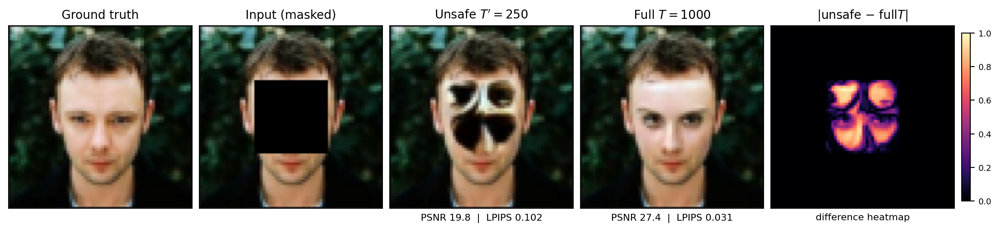
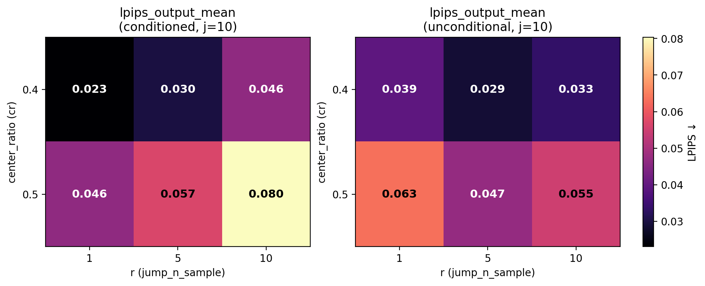

# Diffusion Image Inpainting

End-to-end **image inpainting with denoising diffusion probabilistic models (DDPMs)**, built on my own from-scratch DDPM stack
([`generative-models`](https://github.com/HusseinHanafy207/generative-models): noise schedule + U-Net reused, not copied).

This repo supports:

- **Mask-conditioned** training (`concat(x_t, masked image, mask) → ε̂`)
- **Unconditional** face DDPMs with masks applied only at test time
- **RePaint** inference (noise-matched known-pixel stitch + resampling jumps `(j, r)`)
- Stratified evaluation on **MNIST**, **Fashion-MNIST**, and **CelebA** ($64\times64$)

```text
image_inpainting  →  imports  →  generative_models.ddpm
```

---

## Papers

Two write-ups document the research arc (PDFs in [`docs/`](docs/)):

| Paper | PDF | One-line claim |
|-------|-----|----------------|
| **Technical report** — *Inference Protocol Matters* | [`docs/Technical_report.pdf`](docs/Technical_report.pdf) | Truncating reverse length below trained $T$ while starting from pure noise silently ruins face fills and metrics |
| **Final paper** — *Resampling Is Not Always Better* | [`docs/Final_paper.pdf`](docs/Final_paper.pdf) | RePaint resampling $r$ **helps** unconditional models but **hurts** mask-conditioned ones on large contiguous holes |

LaTeX sources: [`docs/paper_overleaf/`](docs/paper_overleaf/) (technical report) · [`docs/paper_neurips/`](docs/paper_neurips/) (final paper).

---

## Findings (technical report)

**Inference protocol is part of the result.**  
Sampling the same CelebA checkpoint with a mismatched truncated reverse chain ($T'{=}250$, pure-noise init) vs.\ the full trained schedule ($T{=}1000$) changes quality dramatically.

Conditioned `epoch_030`, center `cr=0.4`, $n{=}100$, RePaint $j{=}10$, $r{=}5$:

| Reverse length | PSNR ↑ | SSIM ↑ | Hole PSNR ↑ | LPIPS ↓ |
|----------------|--------|--------|-------------|---------|
| $T'{=}250$ (mismatched) | $19.75 \pm 5.40$ | $0.852 \pm 0.060$ | $11.93$ | $0.102 \pm 0.063$ |
| Full $T{=}1000$ | $27.36 \pm 3.45$ | $0.939 \pm 0.025$ | $19.53$ | $0.031 \pm 0.020$ |

Paired ΔPSNR $= 7.61$ dB ($p = 3.06\times10^{-23}$); ΔLPIPS $= -0.071$ ($p = 2.98\times10^{-19}$).

Under a corrected full-$T$ protocol: sparse brush/holes masks are near-solved; large centers remain hardest; short finetunes help only modestly; unconditional RePaint matches conditioned PSNR (FaceNet identity gap not significant at $n{=}32$).

The released CLI **defaults to full $T$** and refuses unsafe truncated schedules unless an explicit override is set.

<p align="center">
  
</p>

---

## Findings (final paper)

**Resampling is not universally beneficial.**  
After fixing the reverse-length protocol, we ask when RePaint’s own resampling count $r$ helps or hurts.

Under paired, seed-matched CelebA center-mask eval ($n{=}32$, $j{=}10$, full $T{=}1000$):

- **Conditioned** ($r{=}10$ vs $r{=}1$): quality **degrades** — ΔPSNR $\approx -2.7$ dB, large effect size, $p < 10^{-6}$
- **Unconditional** ($r{=}5$ vs $r{=}1$): quality **improves** — ΔPSNR $\approx +1.6$–$2.2$ dB, $p < 0.01$
- Matched-coverage **brush** control on the conditioned model: **null** (not explained by masked pixel count alone)
- Cost scales nearly linearly with $r$ ($\sim 10\times$ NFEs / wall-clock at $r{=}10$ vs $r{=}1$)
- External check on RePaint’s pretrained unconditional CelebA-HQ checkpoint: higher $r$ helps; conditioned-style degradation is absent

A single default $(j,r)$ across both training regimes is therefore misleading — and for conditioned models on large centers, actively costly.

<p align="center">
  
</p>

---

## Results data

Curated numbers, paired stats, and key figures from both papers live in [`Results/`](Results/):

- Per-setting eval CSVs / JSON summaries (`eval_center_cr040_*`, `eval_center_cr050_*`, conditioned and unconditional, $r\in\{1,5,10\}$)
- Paired resampling stats: `paired_r_stats_n32.csv`
- LPIPS heatmap used in the final paper: `heatmap_lpips_output_mean_cr040_050_cond_vs_uncond_j10.png`
- Paper checkpoints used for those runs (`epoch_030_*.pt`, `epoch_040_*.pt`) — kept locally under `Results/` (gitignored; too large for GitHub)

Qualitative grids for the final paper also sit under [`docs/paper_neurips/figures/`](docs/paper_neurips/figures/). Technical-report figures used in this README are under [`docs/assets/`](docs/assets/).

---

## Setup

```bash
# sibling dependency (DDPM schedule + U-Net)
pip install -e /path/to/generative-models

pip install -e ".[dev]"
# optional LPIPS metrics
pip install -e ".[perceptual]"

pytest -q
```

---

## Training & sampling

Configs live in [`configs/`](configs/). Scripts: [`scripts/train.py`](scripts/train.py), [`scripts/train_unconditional.py`](scripts/train_unconditional.py), [`scripts/inpaint.py`](scripts/inpaint.py), [`scripts/evaluate.py`](scripts/evaluate.py).

### Local (conditioned CelebA)

```bash
# Train (omit --timesteps-related flags; training uses schedule T from the config)
python scripts/train.py \
  --config configs/celeba.yaml \
  --epochs 40 \
  --device cuda \
  --num-workers 2 \
  --checkpoint-dir outputs/celeba/checkpoints \
  --log-dir outputs/celeba/logs \
  --sample-dir outputs/celeba/samples

# Resume
python scripts/train.py \
  --config configs/celeba.yaml \
  --resume outputs/celeba/checkpoints/latest.pt \
  --epochs 40 \
  --device cuda \
  --checkpoint-dir outputs/celeba/checkpoints \
  --log-dir outputs/celeba/logs \
  --sample-dir outputs/celeba/samples

# Inpaint (default reverse length = trained T=1000)
python scripts/inpaint.py \
  --config configs/celeba.yaml \
  --checkpoint outputs/celeba/checkpoints/epoch_030.pt \
  --mask-type center \
  --center-ratio 0.4 \
  --num-samples 8 \
  --device cuda \
  --seed 42 \
  --jump-length 10 \
  --jump-n-sample 5 \
  --out-dir outputs/celeba/samples
```

### Colab + Google Drive (example)

```bash
%cd /content/diffusion-image-inpainting

DRIVE = "/content/drive/MyDrive/inpainting_runs/celeba"
DATA  = "/content/celeba_data"

!python scripts/train.py \
  --config configs/celeba.yaml \
  --resume {DRIVE}/checkpoints/latest.pt \
  --epochs 40 \
  --device cuda \
  --num-workers 2 \
  --checkpoint-dir {DRIVE}/checkpoints \
  --log-dir {DRIVE}/logs \
  --sample-dir {DRIVE}/samples \
  --data-dir {DATA}

!python scripts/inpaint.py \
  --config configs/celeba.yaml \
  --checkpoint {DRIVE}/checkpoints/latest.pt \
  --mask-type center \
  --num-samples 8 \
  --device cuda \
  --seed 42 \
  --timesteps 1000 \
  --jump-length 10 \
  --jump-n-sample 5 \
  --data-dir {DATA} \
  --out-dir {DRIVE}/samples
```

### Unconditional CelebA

```bash
python scripts/train_unconditional.py \
  --config configs/celeba_unconditional.yaml \
  --epochs 40 \
  --device cuda

python scripts/inpaint.py \
  --config configs/celeba_unconditional.yaml \
  --checkpoint outputs/celeba_uncond/checkpoints/epoch_040.pt \
  --unconditional \
  --mask-type center \
  --center-ratio 0.4 \
  --jump-length 10 \
  --jump-n-sample 5
```

### MNIST / Fashion-MNIST

```bash
python scripts/train.py --config configs/mnist.yaml --epochs 40
python scripts/train.py --config configs/fashion_mnist.yaml --epochs 40

python scripts/inpaint.py --config configs/mnist.yaml \
  --checkpoint outputs/mnist/checkpoints/latest.pt \
  --mask-type center --jump-length 10 --jump-n-sample 5
```

### Evaluation / protocol ablation

```bash
# Full-T eval (recommended default)
python scripts/evaluate.py \
  --config configs/celeba.yaml \
  --checkpoint outputs/celeba/checkpoints/epoch_030.pt \
  --mask-type center --center-ratio 0.4 \
  --max-samples 100 \
  --jump-length 10 --jump-n-sample 5 \
  --lpips

# Mismatched truncated schedule (protocol paper ablation only)
python scripts/evaluate.py \
  --config configs/celeba.yaml \
  --checkpoint outputs/celeba/checkpoints/epoch_030.pt \
  --mask-type center --center-ratio 0.4 \
  --max-samples 100 \
  --timesteps 250 \
  --allow-unsafe-timesteps \
  --jump-length 10 --jump-n-sample 5 \
  --lpips
```

**Notes**

- Omitting `--timesteps` keeps reverse length = trained $T$ (safe default).
- `--timesteps 250` without `--allow-unsafe-timesteps` uses RePaint-style **respacing** (valid subsample of the trained schedule), not the mismatched truncation studied in the technical report.
- `--allow-unsafe-timesteps` enables the broken truncated ablation from the protocol paper.
- `--jump-length` / `--jump-n-sample` are RePaint $(j, r)$. The final paper shows $r$ is **not** a universal default across conditioned vs.\ unconditional models.

---

## Repo layout

```text
configs/                 # MNIST, Fashion-MNIST, CelebA (+ ablations / unconditional)
scripts/                 # train, train_unconditional, inpaint, evaluate, viz helpers
src/image_inpainting/    # datasets, masks, RePaint loop, metrics
tests/
Results/                 # curated paper metrics, stats, heatmap (+ local checkpoints)
docs/
  Technical_report.pdf
  Final_paper.pdf
  paper_overleaf/        # technical-report LaTeX
  paper_neurips/         # final-paper LaTeX
  assets/                # README / technical-report figures
outputs/                 # local training dumps (gitignored; use Results/ for paper numbers)
```

---

## References

- [DDPM](https://arxiv.org/abs/2006.11239) — base diffusion model
- [RePaint](https://arxiv.org/abs/2201.09865) — inference constraints + resampling
- [LPIPS](https://arxiv.org/abs/1801.03924) — perceptual distance
- [Palette](https://arxiv.org/abs/2111.05826) — conditioned image-to-image diffusion

## License

See [LICENSE](LICENSE).
