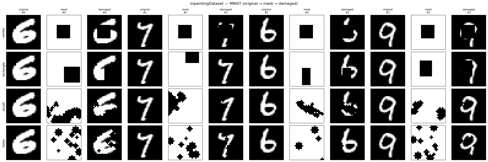
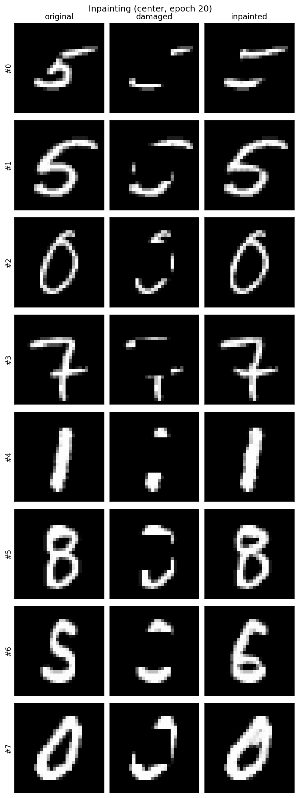
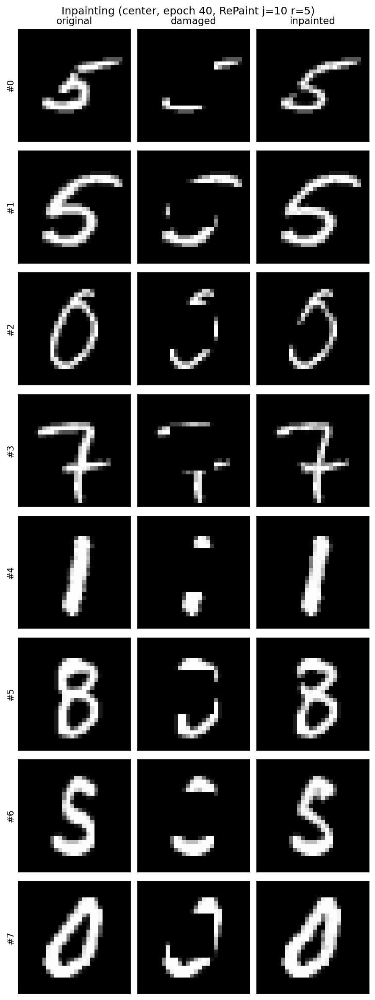
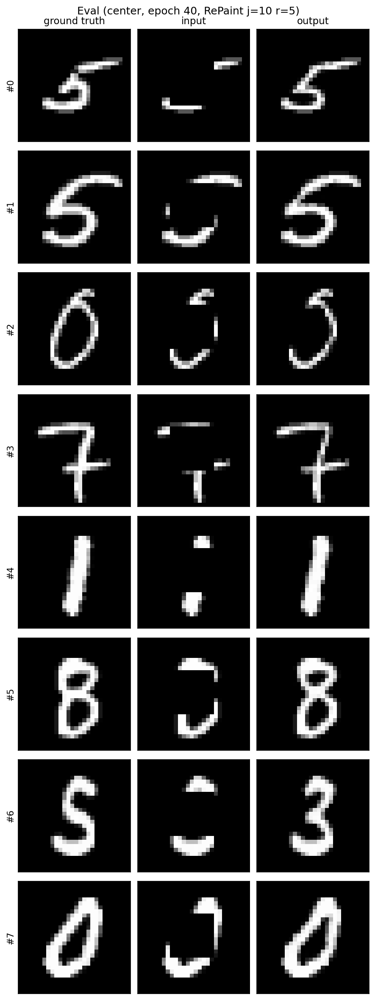
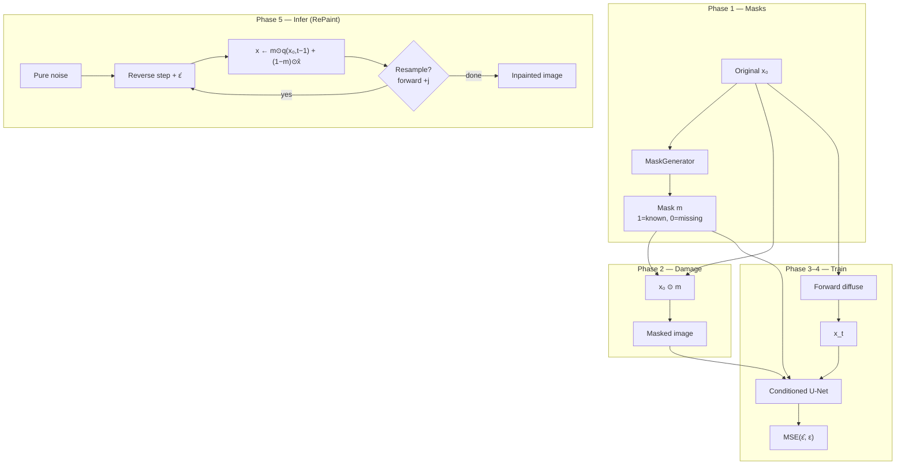

# diffusion-image-inpainting

Mask-conditioned **DDPM image inpainting**. This project does not reimplement diffusion from scratch — it **imports** my existing package and turns it into a practical restoration pipeline.

```
image_inpainting  →  imports  →  generative_models.ddpm
```

That is the usual research-codebase pattern: keep the generative core reusable, and grow applications on top of it.

| Stage | Dataset | Goal |
|-------|---------|------|
| 1 | MNIST | Fast end-to-end pipeline |
| 2 | Fashion-MNIST | Textures |
| 3 | CelebA | Faces |
| 4 | Places365 | Natural scenes |
| 5 | Medical | Domain transfer once the pipeline is solid |

---

## Table of contents

1. [Idea](#idea)
2. [Method](#method)
3. [Results (MNIST)](#results-mnist)
4. [How this relates to my DDPM](#how-this-relates-to-my-ddpm)
5. [Pipeline](#pipeline)
6. [Project structure](#project-structure)
7. [Setup](#setup)
8. [Usage](#usage)
9. [Implementation roadmap](#implementation-roadmap)
10. [Dataset progression](#dataset-progression)
11. [Papers (read as I build)](#papers-read-as-i-build)
12. [License](#license)

---

## Idea

Given an image with missing regions, recover plausible content that matches the known pixels.

```
Original          Mask (1=known)       Damaged            Inpainted
██████████        1111111111           ██████████         ██████████
██  8   ██   +    1110000111     →     ██      ██    →    ██  8   ██
██████████        1111111111           ██████████         ██████████
```

**Scope.** MNIST is the first end-to-end stage so I can validate the method quickly.
I trained until the noise-prediction loss clearly plateaued (**epoch 40**), saved
that checkpoint, and stopped — I am not chasing small MNIST score gains. Next
steps are proper metrics (PSNR / SSIM) and harder datasets.

---

## Method

### Conditioned DDPM

Standard DDPM trains a U-Net to predict noise \(\varepsilon\) in
\(x_t = \sqrt{\bar\alpha_t}\,x_0 + \sqrt{1-\bar\alpha_t}\,\varepsilon\).
For inpainting I keep that loss, but the network also sees what is known:

```text
input = concat(x_t, masked_image, mask)   # 3 channels on MNIST
predict ε̂  →  MSE(ε̂, ε)
```

- `masked_image` = \(x_0 \odot m\) (zeros in the hole)
- `mask` \(m\): **1 = known**, **0 = missing**

So the model is a **mask-conditioned denoiser**, not an unconditional generator
that I only constrain at test time. Training still forward-diffuses the *full*
clean image; the mask only changes what the U-Net observes.

### RePaint sampling

At inference I start from pure noise and run the reverse chain. After every
reverse step I force known pixels to agree with the observation — the idea
from [RePaint](https://arxiv.org/abs/2201.09865). The hole stays free; the
known region is locked.

### Noisy known-pixel reinsertion

The naive lock uses **clean** \(x_0\) every step:

```text
x ← m ⊙ x₀ + (1 − m) ⊙ x̂     # wrong at high t
```

At large \(t\) the hole is still noisy while known pixels would be sharp.
That clean/noisy boundary never appears in training, so the U-Net is asked
to denoise an out-of-distribution canvas.

The correct lock matches **noise level** to the current timestep by
re-noising the observation with the same forward process \(q\):

```text
x_{t-1} = m ⊙ q(x₀, t−1) + (1 − m) ⊙ x̂_{t-1}
```

Only at \(t = 0\) are known pixels exactly the clean observation.

### Resampling

Noise-matched reinsertion fixes distribution mismatch, but the hole can still
be poorly *harmonized* with the known region. RePaint’s resampling schedule
periodically jumps **forward** in diffusion time (add noise for `j` steps),
then denoises again, repeating `r` times (`jump_length`, `jump_n_sample` in
the CLI). That lets the unknown region renegotiate with the known pixels
before finishing the reverse chain.

Trade-off: larger `j` / `r` improves harmonization and multiplies wall-clock
cost (full \(T=1000\), \(j=10\), \(r=10\) is heavy on CPU).

---

## Results (MNIST)

### Training

Conditioned U-Net (~16.2M params), \(T = 1000\), batch size 64, Adam
\(lr = 2\times10^{-4}\), mixed mask types. Trained on Colab GPU; checkpoints
and logs live under `outputs/` locally (gitignored).

| Checkpoint | Val loss | Note |
|------------|----------|------|
| Epoch 1 | 0.0076 | Warm start |
| Epoch 20 | 0.0029 | Already near plateau |
| **Epoch 40** (`latest.pt`) | **0.0026** | Stopped here — clearly converged |

From ~epoch 20 onward, val loss only wobbles in a narrow band (~0.0026–0.0029).
Extra epochs past 40 were not worth the time for this stage.

### Masks

<p align="center">
  
</p>

### Inpainting (center mask, epoch-40 weights)

Noise-matched RePaint stitch (epoch-20 preview still useful for comparison):

<p align="center">
  
</p>

With resampling on the converged checkpoint (`j=10`, `r=5`, preview \(T=250\)):

<p align="center">
  
</p>

Known pixels match the observation exactly. Remaining mistakes are mostly
**ambiguous holes** (e.g. 5↔6) where the visible rim fits more than one digit —
not seam / noise-mismatch artifacts.

### Quantitative eval (Phase 6)

Held-out MNIST, center mask, epoch-40 checkpoint, RePaint
`j=10`, `r=5`, preview \(T=250\), **32** images (seed 42).

| | PSNR ↑ | SSIM ↑ |
|--|--------|--------|
| **Input** (damaged vs GT) | 12.87 | 0.662 |
| **Output** (inpainted vs GT) | **19.26 ± 3.31** | **0.889 ± 0.063** |

Hole-only PSNR (missing pixels only): **4.76 → 11.14** (input → output).

Comparison layout: ground truth | input | output

<p align="center">
  
</p>

```bash
python scripts/evaluate.py --checkpoint outputs/checkpoints/epoch_040.pt \
  --mask-type center --max-samples 32 --timesteps 250 \
  --jump-length 10 --jump-n-sample 5 --out-dir outputs/eval
```

---

## How this relates to my DDPM

| Component | Lives in | Role here |
|-----------|----------|-----------|
| Noise schedule, forward diffusion | `generative_models.ddpm` | Reused as-is |
| U-Net backbone | `generative_models.ddpm.UNet` | Reused with **more input channels** |
| Noise-prediction MSE | `generative_models.losses` | Reused |
| MaskGenerator | **this repo** | Create known/missing masks |
| InpaintingDataset | **this repo** | `(original, masked, mask)` |
| ConditionedUNet | **this repo** | Concat `[x_t \| masked \| mask]` |
| Inpaint sampler | **this repo** | RePaint reverse + resampling (`j`, `r`) |
| PSNR / SSIM | **this repo** | Evaluation |

I do **not** copy DDPM source into this tree. I install the sibling package and import it.

---

## Pipeline



Training path in short:

```text
original → mask → damaged → forward diffuse → UNet(x_t, masked, mask) → MSE(ε̂, ε)
```

### U-Net input (MNIST)

| Channel group | Channels | Meaning |
|---------------|----------|---------|
| `x_t` | 1 | Noisy latent at timestep \(t\) |
| masked image | 1 | Known pixels (zeros in the hole) |
| mask | 1 | Binary known/missing map |
| **Total** | **3** | `in_channels=3` into reused U-Net |

### Mask types (`MaskGenerator`)

| Type | What it simulates |
|------|-------------------|
| Center square | Large contiguous hole |
| Random rectangle | Irregular block occlusion |
| Brush strokes | Scratches / strokes |
| Random holes | Scattered missing pixels |

See the grid under [Results](#results-mnist).

---

## Project structure

```
diffusion-image-inpainting/
├── configs/
│   └── mnist.yaml              # Stage 1 hyperparameters
├── docs/assets/                # README figures (masks + sample grids)
├── data/                       # Datasets (gitignored)
├── notebooks/                  # Optional exploration
├── outputs/                    # Checkpoints, samples, logs (gitignored)
├── scripts/
│   ├── visualize_masks.py      # Phase 1–2 sanity grids
│   ├── train.py                # Phase 4
│   ├── inpaint.py              # Phase 5
│   └── evaluate.py             # Phase 6
├── tests/
│   └── test_imports.py         # Package + generative_models.ddpm smoke test
└── src/image_inpainting/
    ├── masks/                  # MaskGenerator
    ├── datasets/               # InpaintingDataset
    ├── models/                 # ConditionedUNet → generative_models.ddpm.UNet
    ├── diffusion/              # RePaint-style sampler
    ├── trainers/               # Mask-conditioned training loop
    ├── evaluation/             # PSNR, SSIM
    └── utils/                  # YAML config helpers
```

---

## Setup

### 1. Install my DDPM package

This project depends on [`generative-models`](https://github.com/HusseinHanafy207/generative-models) (specifically `generative_models.ddpm`). Clone it and install in editable mode:

```bash
git clone https://github.com/HusseinHanafy207/generative-models.git
pip install -e ./generative-models
```

If `generative-models` already lives next to this repo, point `pip` at that checkout instead:

```bash
pip install -e /path/to/generative-models
```

### 2. Install this project

```bash
python -m venv .venv
.venv\Scripts\activate          # Windows
# source .venv/bin/activate     # macOS / Linux

pip install -r requirements.txt
pip install -e ".[dev]"
```

### 3. Verify imports

```bash
pytest tests/test_imports.py -q
python -c "from generative_models.ddpm import UNet, NoiseScheduler; print('DDPM OK')"
python -c "import image_inpainting; print(image_inpainting.__version__)"
```

---

## Usage

```bash
# Mask sanity grid
python scripts/visualize_masks.py --out-dir outputs/figures

# Train / resume (I stopped at epoch 40 when val loss plateaued)
python scripts/train.py --config configs/mnist.yaml --epochs 40
python scripts/train.py --resume outputs/checkpoints/latest.pt --epochs 40

# Inpaint — default checkpoint is epoch 40 (`latest.pt`)
# r=1 disables resampling; paper-ish defaults are j=10, r=10
python scripts/inpaint.py --checkpoint outputs/checkpoints/latest.pt --mask-type center
python scripts/inpaint.py --checkpoint outputs/checkpoints/epoch_040.pt \
  --mask-type center --jump-length 10 --jump-n-sample 10

# Evaluate — GT | input | output + PSNR / SSIM
python scripts/evaluate.py --checkpoint outputs/checkpoints/epoch_040.pt \
  --mask-type center --max-samples 32 --timesteps 250 \
  --jump-length 10 --jump-n-sample 5 --out-dir outputs/eval
```

On Colab, point `--checkpoint-dir`, `--log-dir`, `--sample-dir`, and `--data-dir`
at Drive so disconnects do not wipe the run.

---

## Implementation roadmap

I build in this order:

| Stage | Deliverable | Module / script |
|-------|-------------|-----------------|
| **0** | Project layout + README + import from DDPM | ✅ scaffold |
| **1** | Flexible `MaskGenerator` | ✅ `masks/generator.py`, `visualize_masks.py` |
| **2** | `InpaintingDataset` → `(x, masked, mask)` | ✅ `datasets/inpainting.py` |
| **3** | Condition U-Net on masked image + mask | ✅ `models/conditioned_unet.py` |
| **4** | Training loop (mask → diffuse → MSE) | ✅ trained to epoch 40 (converged) |
| **5** | RePaint inference (noise-match + resampling) | ✅ `diffusion/inpaint_sampler.py`, `scripts/inpaint.py` |
| **6** | Visual + PSNR / SSIM | ✅ `evaluation/metrics.py`, `scripts/evaluate.py` |
| **7** | Harder datasets → medical | new configs under `configs/` |

### Phase checklist

- [x] Stage 0 — repo structure, configs, README
- [x] Stage 1 — masks (center, rectangle, brush, holes)
- [x] Stage 2 — damaged images via `InpaintingDataset`
- [x] Stage 3 — conditioned U-Net input channels
- [x] Stage 4 — training (stopped at epoch 40; val loss ~0.0026)
- [x] Stage 5 — RePaint noise-matched stitch + resampling (`j`, `r`)
- [x] Stage 6 — evaluation metrics (PSNR / SSIM; hole-only PSNR)
- [ ] Stage 7 — Fashion-MNIST → CelebA → Places365 → medical

---

## Dataset progression

I will not jump straight to medical images. I will use the same pipeline and raise difficulty:

1. **MNIST** — pipeline validated; checkpoint at epoch 40  
2. **Fashion-MNIST** — edges and textures  
3. **CelebA** — structure and identity  
4. **Places365** — diverse natural scenes  
5. **Medical** — once train / inpaint / eval are trustworthy  

Each new dataset should mostly mean a new YAML config and dataloader adapter — not a rewrite.

---

## Papers (read as I build)

I will not read everything up front. I will pair each paper with the phase it unlocks:

| Paper | When |
|-------|------|
| [DDPM](https://arxiv.org/abs/2006.11239) (Ho et al., 2020) | I already implemented this |
| [RePaint](https://arxiv.org/abs/2201.09865) (2022) | Phase 5 — sampling with known-pixel constraints |
| [Palette](https://arxiv.org/abs/2111.05826) (2022) | Conditioning one diffusion model for inpainting (and related tasks) |
| Stable Diffusion Inpainting | Later — latent-space inpainting in modern systems |

---

## License

See [LICENSE](LICENSE).
