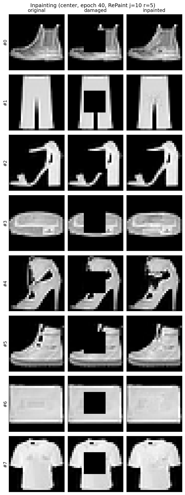
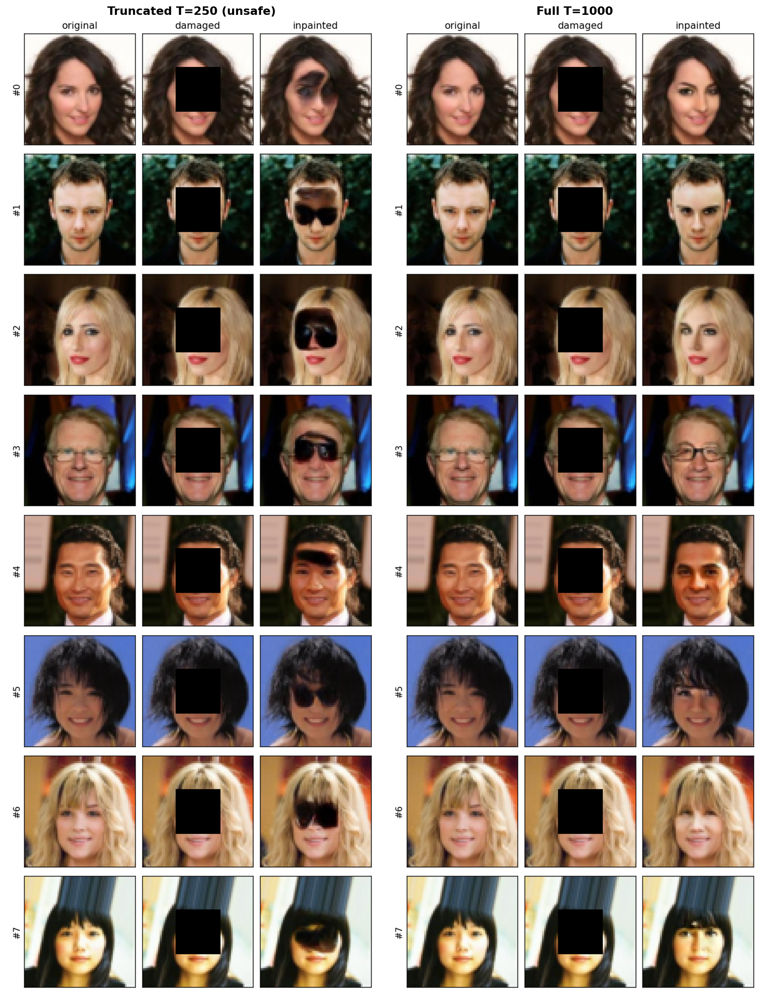
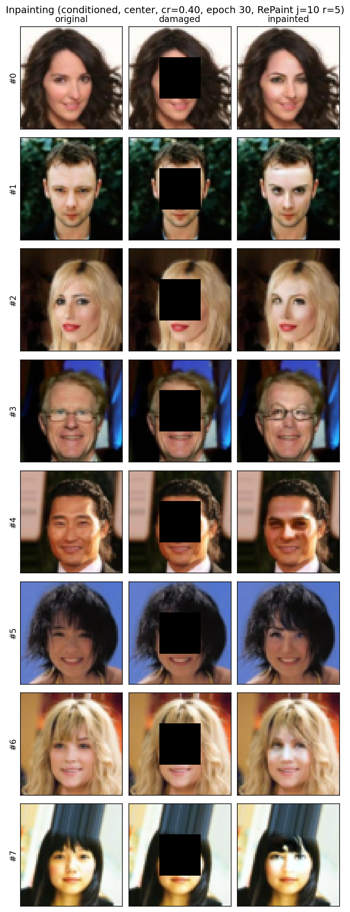
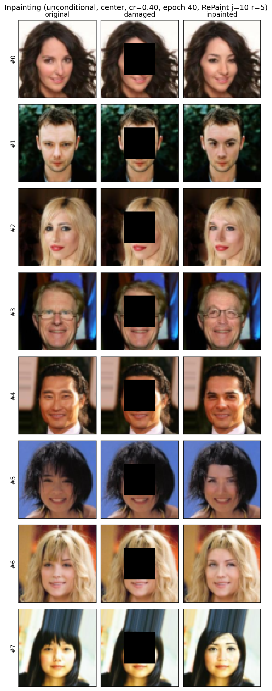

# Diffusion Image Inpainting

Mask-conditioned and unconditional **DDPM inpainting** with **RePaint**, built on my
[`generative-models`](https://github.com/HusseinHanafy207/generative-models) package
(noise schedule and U-Net reused, not copied).

```text
image_inpainting  →  imports  →  generative_models.ddpm
```

| Stage | Dataset | Status |
|-------|---------|--------|
| 1 | MNIST | Done |
| 2 | Fashion-MNIST | Done |
| 3 | CelebA (64×64) | Done |
| — | Places365 / medical | Future |

---

## Method

**Conditioned train.** Concatenate noisy latents with mask context:

```text
concat(x_t, masked_image, mask)  →  ε̂     # MSE vs true noise
```

**Unconditional train.** Standard RGB DDPM on clean faces (`in_channels=3`).

**Inference (both).** RePaint: reverse step → stitch known pixels at matching noise
`q(x₀, t−1)` → optional jumps `(j, r)`. Use **full trained T** (default 1000).
Truncating `--timesteps` below `T` from pure noise is refused unless
`--allow-unsafe-timesteps`.

<p align="center">
  
</p>
<p align="center"><em>Noise-matched known-pixel stitch (MNIST).</em></p>

---

## Results

### MNIST / Fashion-MNIST

Center mask, epoch 40, RePaint `j=10`, `r=5`:

| Dataset | PSNR ↑ | SSIM ↑ |
|---------|--------|--------|
| MNIST | ~19.3 | ~0.89 |
| Fashion-MNIST | ~24.1 | ~0.87 |

<p align="center">
  
  
</p>

### CelebA — protocol sensitivity

Same conditioned checkpoint (`epoch_030`), center `cr=0.4`, `n=32`, RePaint `j=10`, `r=5`.
Truncating the reverse chain to `T'=250` while starting from pure noise produces
systematic dark “sunglasses” fills; full `T=1000` restores coherent faces
(paired *t*-test on PSNR: *p* = 1.84×10⁻⁵, ΔPSNR = 5.99 dB).

| Reverse length | PSNR ↑ | SSIM ↑ | Hole PSNR ↑ |
|----------------|--------|--------|-------------|
| `T'=250` (unsafe) | 20.57 ± 5.55 | 0.858 ± 0.063 | 12.75 ± 5.55 |
| Full `T=1000` | 26.56 ± 4.27 | 0.932 ± 0.027 | 18.73 ± 4.27 |

<p align="center">
  
</p>

### CelebA — stratified masks (full T)

Conditioned `epoch_030`, full `T=1000`:

| Setting | PSNR ↑ | SSIM ↑ | Hole PSNR ↑ |
|---------|--------|--------|-------------|
| Center `cr=0.20` | 37.67 | 0.992 | 23.82 |
| Center `cr=0.30` | 32.17 | 0.975 | 21.62 |
| Center `cr=0.40` | 26.56 | 0.932 | 18.73 |
| Brush | 40.47 | 0.994 | 25.71 |
| Holes | 43.84 | 0.997 | 27.70 |

Sparse masks are near-solved; large contiguous centers remain hardest.

### CelebA — ablations & conditioned vs unconditional

Center `cr=0.4`, full `T=1000`. Short finetunes help only modestly (~+2 dB vs epoch 30).
Unconditional RePaint matches PSNR; FaceNet (VGGFace2) cosine similarity is
**0.485 ± 0.187** (conditioned) vs **0.462 ± 0.172** (unconditional), `n=32`.

| Checkpoint | PSNR ↑ | SSIM ↑ | Hole PSNR ↑ |
|------------|--------|--------|-------------|
| Baseline epoch 30 | 26.56 | 0.932 | 18.73 |
| Baseline epoch 40 | 27.11 | 0.934 | 19.29 |
| Phase 2 LR finetune (e35) | 28.56 | 0.942 | 20.73 |
| Phase 3 hole-weighted loss (e40) | 28.65 | 0.942 | 20.82 |
| Phase 4b curriculum (e50) | 28.63 | 0.943 | 20.81 |
| Unconditional epoch 40 + RePaint | 26.93 | 0.928 | 19.10 |

<p align="center">
  
  
</p>
<p align="center"><em>Left: conditioned. Right: unconditional + RePaint. Full T, cr=0.4.</em></p>

Configs: `configs/celeba*.yaml`.

---

## Setup

```bash
pip install -e /path/to/generative-models
pip install -e ".[dev]"
pytest -q
```

## Usage

```bash
# Conditioned (omit --timesteps → full T)
python scripts/train.py --config configs/celeba.yaml --epochs 40
python scripts/inpaint.py --config configs/celeba.yaml \
  --checkpoint outputs/celeba/checkpoints/epoch_030.pt \
  --mask-type center --center-ratio 0.4 \
  --jump-length 10 --jump-n-sample 5
python scripts/evaluate.py --config configs/celeba.yaml \
  --checkpoint outputs/celeba/checkpoints/epoch_030.pt \
  --mask-type center --center-ratio 0.4 --max-samples 32 \
  --jump-length 10 --jump-n-sample 5

# Unconditional
python scripts/train_unconditional.py --config configs/celeba_unconditional.yaml --epochs 40
python scripts/inpaint.py --config configs/celeba_unconditional.yaml \
  --checkpoint outputs/celeba_uncond/checkpoints/epoch_040.pt \
  --unconditional --mask-type center --center-ratio 0.4 \
  --jump-length 10 --jump-n-sample 5
```

---

## Technical report

Workshop-style LaTeX writeup:
[`docs/paper_overleaf.zip`](docs/paper_overleaf.zip)
(Overleaf → New Project → Upload Project → Recompile with pdfLaTeX).

```text
configs/   scripts/   src/image_inpainting/   tests/   docs/assets/
```

## References

- [DDPM](https://arxiv.org/abs/2006.11239) — base model (sibling package)
- [RePaint](https://arxiv.org/abs/2201.09865) — inference constraints + resampling

## License

See [LICENSE](LICENSE).
